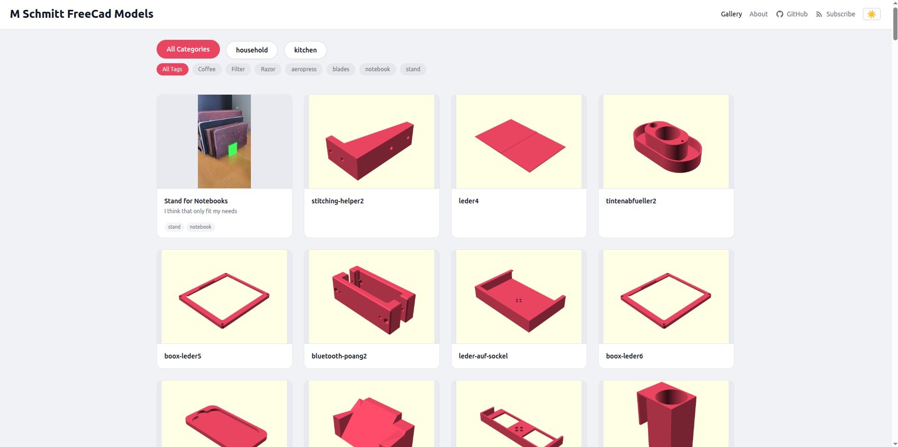

# CAD Gallery

[](https://github.com/schmiddim/freecad-action/actions/workflows/cad-gallery.yaml)
[](LICENSE)
[](https://github.com/schmiddim/freecad-action/releases)
[](https://github.com/schmiddim/freecad-action/pkgs/container/freecad-action)

Self-hosted 3D model gallery powered by FreeCAD, Three.js and GitHub Pages.

**[Live Demo](https://schmiddim.github.io/freecad/)**


<!-- Replace the screenshot URL above with an actual screenshot of your gallery -->

## Why?

Platforms like MakerWorld, Thingiverse and Printables are great for sharing models, but you don't own your gallery. If the platform goes down or changes its terms, your portfolio disappears. CAD Gallery gives you a self-hosted, version-controlled 3D model gallery that lives in your GitHub repo and deploys automatically to GitHub Pages. Push a `.FCStd` file, get a gallery with interactive 3D previews -- no server needed.

## Quick Start

All you need is a repo with `.FCStd` files and one workflow file. No config, no templates, no metadata required -- the action provides sensible defaults for everything.

**Your repo structure:**

```
my-cad-models/
  Model_A.FCStd
  Model_B.FCStd
  .github/workflows/cad-gallery.yaml
```

**The workflow file:**

```yaml
# .github/workflows/cad-gallery.yaml
name: CAD Gallery

on:
  push:
    branches: [main]

permissions:
  contents: read
  pages: write
  id-token: write

jobs:
  build-and-deploy:
    runs-on: ubuntu-latest
    environment:
      name: github-pages
      url: ${{ steps.deploy.outputs.page_url }}
    steps:
      - uses: actions/checkout@v6
        with:
          fetch-depth: 0

      - name: Build Gallery
        uses: schmiddim/freecad-action@v2

      - uses: actions/configure-pages@v6

      - uses: actions/upload-pages-artifact@v5
        with:
          path: ./gallery

      - id: deploy
        uses: actions/deploy-pages@v5
```

**Prerequisites:** Enable GitHub Pages in your repo settings (Settings > Pages > Source: GitHub Actions).

## Features

- Automatic STL export from FreeCAD `.FCStd` files
- Interactive 3D viewer with Three.js (OrbitControls)
- Metadata support: descriptions, tags, images, license, external links
- Tag-based filtering in the gallery view
- Download buttons for STL and FCStd files in the detail view
- Maker profile with About-page and links to GitHub, MakerWorld, Thingiverse, Printables
- GitHub link with icon in the navigation header
- Dark/light mode -- follows system preference, toggle button on every page
- Configurable gallery title via `cad-gallery.yaml`
- Discovery document at `gallery/discovery/cad-gallery.json` (machine-readable index)
- Optional aggregator ping on every build
- RSS and Atom feeds
- Fallback display for models without metadata
- Fully buildable and testable locally via Makefile + Docker

## Adding Model Metadata

Create a YAML file in `metadata/` matching your FCStd filename:

```yaml
# metadata/my-model.yaml
title: "My Cool Model"
description: "A detailed description of the model."
tags:
  - bracket
  - 3d-print
images:
  - filename: "photo1.jpg"
    caption: "Printed version"
license: "CC-BY-SA-4.0"
links:
  makerworld: "https://makerworld.com/en/models/..."
  printables: "https://www.printables.com/model/..."
```

Place additional images in `metadata/images/{model_name}/`.

Models without metadata are still displayed with a 3D preview and a hint showing which file to create.

## Configuration

Edit `cad-gallery.yaml` to configure paths and the gallery title:

```yaml
# yaml-language-server: $schema=https://raw.githubusercontent.com/schmiddim/freecad-action/refs/tags/v2.8.9/schemas/cad-gallery.schema.json
title: "My 3D Models"          # Optional, default: "CAD Gallery"
freecad_dir: "freecad-files"   # Where your .FCStd files are
metadata_dir: "metadata"       # Where metadata YAMLs and images are
output_dir: "gallery"          # Where the HTML gallery is generated
exports_dir: "exports"         # Where STL exports go
```

If your `.FCStd` files are in the repo root, set `freecad_dir: "."`.

## Maker Profile (Optional)

Create a `maker.yaml` in your repo root to enable the About-page and add your profile links to the navigation:

```yaml
# yaml-language-server: $schema=https://raw.githubusercontent.com/schmiddim/freecad-action/refs/tags/v2.8.9/schemas/maker.schema.json
name: "Your Name"
bio: "Short description about you."
links:
  github: "https://github.com/..."
  makerworld: "https://makerworld.com/en/@..."
  thingiverse: "https://www.thingiverse.com/..."
  printables: "https://www.printables.com/@..."
```

When `maker.yaml` is present:
- An **About** page is generated at `gallery/about.html`
- An **About** link appears in the header navigation
- The **GitHub link** (with icon) appears in the header navigation

## Discovery & Aggregator

Every gallery build generates a machine-readable discovery document at:

```
gallery/discovery/cad-gallery.json
```

It contains the gallery metadata, all models (with STL/FCStd URLs, tags, license), the maker profile and the source repository URL. The schema is at [`schemas/discovery.schema.json`](schemas/discovery.schema.json).

### Aggregator Ping

By default, your gallery is standalone and does not communicate with any external service. If you opt in by setting `send-ping: 'true'`, your gallery will be automatically listed on the **[FreeCAD Aggregator](https://freecad-aggregator.fly.dev/)** -- a public directory of CAD Gallery instances. This makes your models discoverable by other makers.

```yaml
- name: Build Gallery
  uses: schmiddim/freecad-action@v2
  with:
    send-ping: 'true'
```

When enabled, the action sends a `POST` request after each successful build containing `discovery_url`, `git_source_url` and `event: "push"` to the aggregator at `https://freecad-aggregator.fly.dev/`. No API key or registration needed -- it just works.

**What gets published:** Your gallery title, model names, tags, license info, and links to your STL/FCStd files -- the same information that is already public on your GitHub Pages site. No private data is sent.

**Note:** The aggregator is currently work in progress and will be open-sourced soon.

## Action Reference

### Inputs

| Input | Description | Default |
|---|---|---|
| `use-docker` | Use Docker for FreeCAD export (recommended) | `true` |
| `send-ping` | Publish your gallery to the [FreeCAD Aggregator](https://freecad-aggregator.fly.dev/) | `false` |

### Outputs

| Output | Description |
|---|---|
| `models-count` | Number of models exported and built |

### Version Pinning

```yaml
uses: schmiddim/freecad-action@v2       # Latest 2.x (recommended)
uses: schmiddim/freecad-action@v2.8     # Latest 2.8.x
uses: schmiddim/freecad-action@v2.8.9   # Exact version
```

### Custom Templates (Optional)

The action ships with default HTML templates. To customize the gallery appearance, create a `templates/` directory in your repo with `gallery.html`, `detail.html` and/or `about.html`. Your templates will take precedence over the defaults.

## Project Structure

```
freecad-files/             # FreeCAD .FCStd source files (flat, no subdirs)
metadata/                  # Model metadata YAML files
  my-model.yaml            # Must match FCStd filename (without extension)
  images/                  # Additional images per model
    my-model/
      photo1.jpg
schemas/                   # JSON Schemas for validation
  cad-gallery.schema.json  # Schema for cad-gallery.yaml
  maker.schema.json        # Schema for maker.yaml
  meta.schema.json         # Schema for metadata/*.yaml
  discovery.schema.json    # Schema for discovery document
scripts/                   # Build scripts
  export.py                # FreeCAD -> STL export
  build_gallery.py         # Generate HTML gallery from templates + metadata
  validate.py              # Validate YAML files against schemas
  build.sh                 # Entrypoint used by Makefile and action.yml
  templates/               # Jinja2 HTML templates + CSS
cad-gallery.yaml           # Configuration (paths, gallery title)
maker.yaml                 # Maker profile (name, bio, links) -- optional
Makefile                   # Local build targets
Dockerfile                 # FreeCAD Docker image for export
pyproject.toml             # Python dependencies
```

## Local Development

### Prerequisites

- Docker (for FreeCAD export)
- Python 3.10+ (for gallery build)

### Setup

```bash
pip install -e ".[dev]"
```

### Makefile Targets

```bash
make help          # Show all available targets
make docker-build  # Build the FreeCAD Docker image
make export        # Export STL from FCStd files (via Docker)
make gallery       # Build the HTML gallery (no Docker needed)
make build         # Full build: export + gallery
make serve         # Build gallery and serve at http://localhost:8000
make validate      # Validate metadata and profile YAML against schemas
make clean         # Remove generated files (exports/ and gallery/)
```

## GitHub Pages Setup

1. Go to your repo **Settings > Pages**
2. Set **Source** to **GitHub Actions**
3. Push to the default branch -- the workflow will build and deploy automatically

## Troubleshooting

### Docker not available

If you see `docker: command not found`, make sure Docker is installed and running. On GitHub Actions (`ubuntu-latest`), Docker is pre-installed.

### Gallery build fails with "no .FCStd files found"

Check that `freecad_dir` in `cad-gallery.yaml` points to the correct directory. The default is `.` (repo root). Files must have the `.FCStd` extension.

### GitHub Pages shows 404

1. Verify Pages is enabled: Settings > Pages > Source: GitHub Actions
2. Check that the workflow completed successfully in the Actions tab
3. The gallery is deployed at `https://<user>.github.io/<repo>/`

### STL export produces empty files

FreeCAD models must contain at least one visible `Part::Feature` or `PartDesign::Body` with a `Shape`. Sketches alone will not export.

### Dark mode not working

The gallery respects `prefers-color-scheme`. The toggle button state is stored in `localStorage`. Clear your browser storage if it seems stuck.

## CI/CD

### Workflows

| Workflow | Trigger | Purpose |
|---|---|---|
| `cad-gallery.yaml` | Push to `master` | Build gallery + deploy to GitHub Pages |
| `docker-publish.yaml` | Push to `master` (Dockerfile changes) or Release | Build + push Docker image to GHCR |
| `release.yaml` | Version tag (`v*.*.*`) | Create GitHub Release + moving version tags |
| `dependabot-automerge.yml` | Dependabot PR | Auto-merge dependency updates |

### Docker Image

The FreeCAD export container is hosted on GitHub Container Registry:

```bash
docker pull ghcr.io/schmiddim/freecad-action:latest
```

## Contributing

See [CONTRIBUTING.md](CONTRIBUTING.md) for guidelines.

## License

[MIT](LICENSE)
